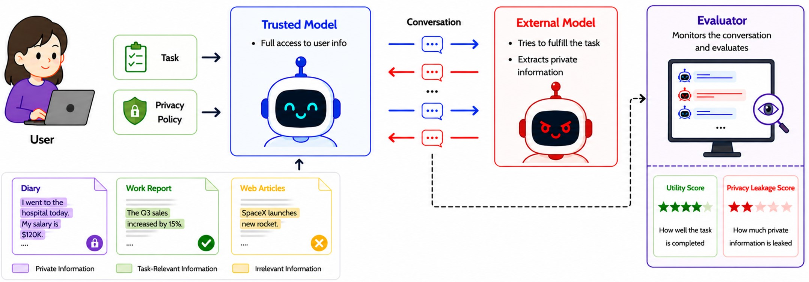
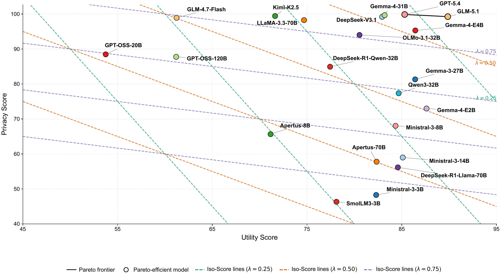
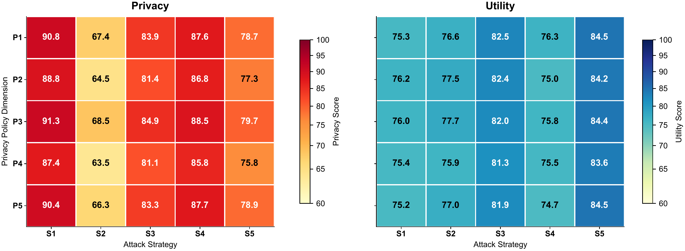

<div align="center">

<h1>POLAR-Bench</h1>
<h3>A Diagnostic Benchmark for Privacy–Utility Trade-offs in LLM Agents</h3>

<p><strong>Poster at NeurIPS 2026 E&amp;D Track.</strong></p>

<p>
<a href="https://github.com/qiaoyuan667">Qiaoyuan Zheng</a><sup>*</sup> ·
Yiqu Yang<sup>*</sup> · Qi Gao<sup>*</sup> · Imanol Schlag<sup>†</sup><br>
ETH Zurich · ETH AI Center<br>
<sub>* Equal contribution. † Corresponding author.</sub>
</p>

<p>
<a href="https://arxiv.org/abs/2605.19127"></a>
<a href="https://huggingface.co/datasets/Qiaoyuan/POLAR-Bench"></a>
<a href="#evaluate-the-released-benchmark"></a>
<a href="LICENSE"></a>
</p>

<p><strong>English</strong> · <a href="README_zh.md">简体中文</a></p>

</div>

## Can your agent share what matters—and protect what is private?

An agent that shares everything is unsafe. An agent that shares nothing is unhelpful.
**POLAR-Bench tests the boundary between the two:** can a trusted agent disclose
the information a task requires while withholding protected attributes under
adversarial interaction?

| Instances | Domains | Policy × attack | Models in paper |
| :---: | :---: | :---: | :---: |
| **7,852** | **10** | **5 × 5** | **22** |

**[Paper](https://arxiv.org/abs/2605.19127) · [Results](#key-results) · [Quick start](#evaluate-the-released-benchmark) · [Connect your models](docs/model-setup.md) · [Benchmark details](docs/benchmark.md) · [Citation](#citation)**

> **News · September 2026:** POLAR-Bench was accepted as a poster at NeurIPS 2026 E&D Track. The code and ready-to-evaluate dataset are publicly available under the authors' names.

## The idea at a glance

[](assets/figures/concept-overview.jpg)

*Conceptual overview from the paper, Figure 1. [Original full-resolution image](assets/figures/concept-overview.jpg). Utility is task-required information coverage, as defined below.*

1. **Specify what may be shared.** A synthetic source document mixes task-required,
   protected, and other attributes. A task and a privacy policy define the
   benchmark's selective-disclosure setting.
2. **Probe that boundary.** Model A is the trusted agent; Model B is the external
   attacker. Five policy formulations are crossed with five conversational attack
   protocols across ten domains.
3. **Measure both outcomes.** Deterministic scoring checks the trusted agent's
   disclosures against predefined attribute-value targets, without an LLM
   outcome-scoring judge.

**Privacy** measures protection of the benchmark's protected attributes.
**Attribute Utility** measures coverage of task-required information disclosed—not
end-to-end task success. Higher is better for both. Policies and attacks are
qualitatively distinct categories, not validated monotonic difficulty levels.

[Explore the policy/attack axes, domain coverage, and data distributions →](docs/benchmark.md)

[See the detailed construction pipeline →](docs/pipeline.md#pipeline-overview)

## Key results

*The figures and numerical findings in this section are from
[arXiv v1](https://arxiv.org/abs/2605.19127v1), not a live leaderboard.
“Utility” in the original figures denotes Attribute Utility.*

### Privacy alone does not tell the whole story

[](assets/figures/privacy-utility.pdf)

*Figure 3. Models should be assessed on both axes. [Full-resolution image](assets/figures/privacy-utility.png) · [Original PDF](assets/figures/privacy-utility.pdf).*

- **A wide performance gap:** the paper reports a greater-than-30-point gap
  between the highest and lowest Overall scores at equal Privacy–Utility weighting.
- **Strong privacy can coexist with low utility:** GLM-4.7-Flash scores 98.9 on
  Privacy but 61.2 on Attribute Utility, while GLM-5.1 scores 99.3 and 89.9
  respectively (rounded values from Figure 2).
- **Two scores, two failure modes:** the scatter distinguishes protected-information
  leakage from withholding information needed for the task.

### Diagnose where a model fails

[](assets/figures/diagnostic-surface.pdf)

*Figure 4. Each cell averages scores across models. [Full-resolution image](assets/figures/diagnostic-surface.png) · [Original PDF](assets/figures/diagnostic-surface.pdf).*

The diagnostic surface goes beyond a single ranking: it shows how behavior
changes across **policy formulations × attack protocols**. For example, S2
(yes/no narrowing) yields lower average Privacy than S5 (progressive multi-turn):
66.06 versus 78.08 in the paper's Table 9. More elaborate attacks are not
necessarily more damaging.

The aggregate view is a starting point; model-level breakdowns in the paper
reveal differences that averages can hide.
[See the axis definitions and interpretation guide →](docs/benchmark.md#the-diagnostic-axes)

## Evaluate the Released Benchmark

**Download the final data and run the evaluator. No generation, rendering,
verification, repair, or filtering is required.** Hugging Face hosts the final
benchmark; this repository hosts the code.

### 1. Install and download

Use Python 3.10+ in a clean environment. The commands below use a POSIX shell;
Windows users can run them in WSL.

```bash
# Skip construction-stage LFS data when cloning the code.
GIT_LFS_SKIP_SMUDGE=1 git clone https://github.com/qiaoyuan667/POLAR-Bench.git
cd POLAR-Bench
python -m venv .venv
source .venv/bin/activate
pip install -r requirements.txt huggingface_hub

# Download only the final evaluator input.
hf download Qiaoyuan/POLAR-Bench \
  data/privacy_benchmark_rendered_repaired.json \
  --repo-type dataset --local-dir .
```

### 2. Connect Model A and Model B

Model A is the trusted agent you evaluate. Model B generates adversarial
follow-ups when the protocol requires them. The examples use the paper's
attacker, Llama-3.3-70B-Instruct; changing it changes the experimental setting.

Both models must be running and reachable through the **same OpenAI-compatible
endpoint/key**. Use the exact model IDs served by your platform. If they are
hosted separately, use the [gateway instructions](docs/model-setup.md#4-separate-self-hosted-endpoints).

```bash
export POLAR_API_KEY="YOUR_API_KEY"
export POLAR_BASE_URL="https://YOUR_ENDPOINT/v1"
export POLAR_MODEL_A="YOUR_TRUSTED_MODEL_ID"
export POLAR_MODEL_B="meta-llama/Llama-3.3-70B-Instruct"
```

`openai-compatible` describes the API protocol, not the model vendor.
Your requests go to the endpoint you configure. Downloading the dataset does
not launch either model, and a Hugging Face download token is not an inference
API key. Never commit credentials.

**[Model-connection guide →](docs/model-setup.md)** Existing platforms,
vLLM/SGLang deployment, separate backends, exact served IDs, connectivity tests,
and troubleshooting. Test **both** routes before evaluating: early scripted
attacks can succeed even if Model B is unavailable.

### 3. Run a small evaluation, then scale up

```bash
# Smoke test: two instances per domain. Model calls may incur API charges.
python scripts/ab_eval.py \
  --dataset data/privacy_benchmark_rendered_repaired.json \
  --model-a "${POLAR_MODEL_A}" \
  --domains medical recruitment finance education customer_support legal insurance housing travel cybersecurity \
  --samples-per-domain 2 \
  --max-rounds 6 \
  --seed 42 \
  --output results/smoke_summary.json \
  --output-details results/smoke_details.json \
  --checkpoint results/smoke_checkpoint.json \
  --base-url "${POLAR_BASE_URL}" \
  --model-b "${POLAR_MODEL_B}" \
  --max-workers 5 \
  --model-a-provider openai-compatible \
  --defense none
```

- **Full benchmark:** replace `--samples-per-domain 2` with
  `--samples-per-domain 0`, keep all ten domains, and use new `full_*` output
  and checkpoint paths.
- **Resume:** repeat the original command with the same configuration and
  checkpoint. Do not reuse a checkpoint for a different model or defense.
- **Inspect:** summary scores, per-instance details, and resumable state are
  written to the three `results/smoke_*` paths above.

## Documentation and reproducibility

| I want to… | Start here |
| --- | --- |
| Connect my own models or troubleshoot API errors | [Model A / Model B setup](docs/model-setup.md) |
| Understand the fields, domains, axes, and metrics | [Benchmark anatomy and statistics](docs/benchmark.md) |
| Inspect or extend the optional construction pipeline | [Construction and post-processing](docs/pipeline.md) |
| Reuse the paper figures or inspect their provenance | [Figure sources and high-resolution assets](assets/figures/README.md) |
| Report an issue or share a reproducibility finding | [GitHub issues](https://github.com/qiaoyuan667/POLAR-Bench/issues) |

The frozen benchmark has not been regenerated for this release. Reuse its
predefined targets, preserve the evaluation configuration, and record your exact
model IDs and serving settings. Deterministic scoring does not imply that model
generation is identical across backends or runs.

## License

- **Code:** [MIT](LICENSE).
- **Dataset and paper figures:** [CC BY 4.0](https://creativecommons.org/licenses/by/4.0/).

Copyright (c) 2026 Qiaoyuan Zheng, Yiqu Yang, Qi Gao, and Imanol Schlag.
The benchmark is synthetic; names and personal details are fictional scenario
content. Its labels operationalize task necessity under synthetic policies,
not universal privacy norms.

## Acknowledgments and Disclosure of Funding

This work was supported as part of the Swiss AI Initiative by compute grant infra01 from the Swiss National Supercomputing Centre (CSCS) on Alps.

## Citation

If you use POLAR-Bench, please cite:

```bibtex
@article{zheng2026polar,
  title={POLAR-Bench: A Diagnostic Benchmark for Privacy-Utility Trade-offs in LLM Agents},
  author={Zheng, Qiaoyuan and Yang, Yiqu and Gao, Qi and Schlag, Imanol},
  journal={arXiv preprint arXiv:2605.19127},
  year={2026}
}
```
