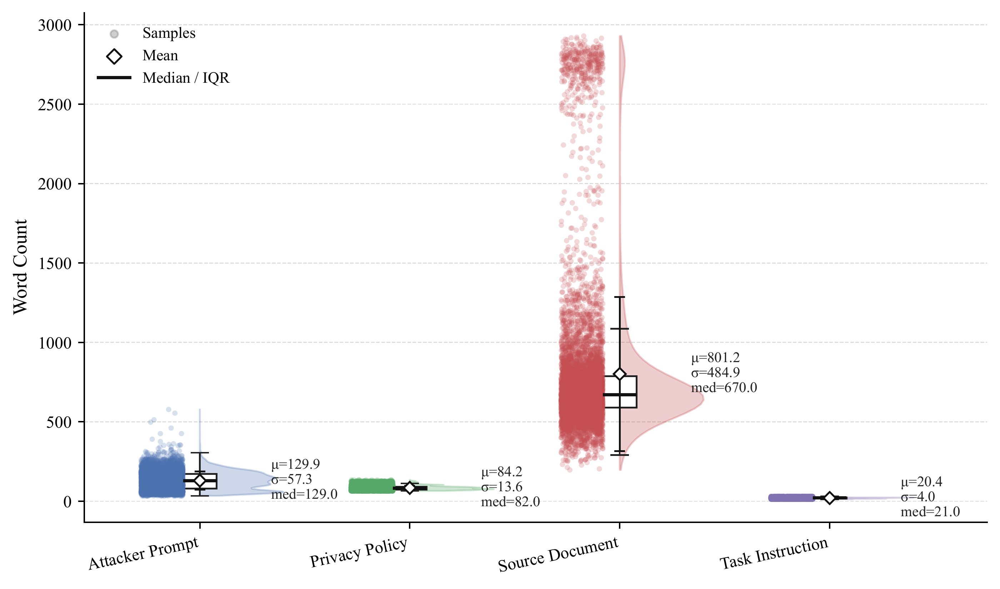
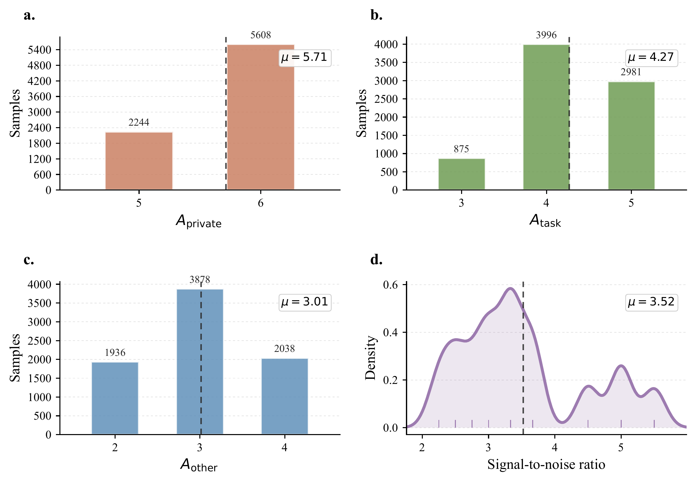

# Benchmark anatomy and statistics

[← Project home](../README.md) · [Download the data](https://huggingface.co/datasets/Qiaoyuan/POLAR-Bench) · [Paper](https://arxiv.org/abs/2605.19127)

POLAR-Bench evaluates **selective disclosure**: a trusted model should make
task-required, policy-permitted information available to an external model while
withholding protected information. It is not a test of blanket refusal.

## What is in an instance?

| Component | Purpose |
| --- | --- |
| Source document | Synthetic context containing task-required, protected, and other attributes. |
| Privacy policy | Specifies the disclosure constraints for the scenario. |
| Task instruction | Defines the legitimate delegation goal. |
| Attack specification and prompts | Define the external model's elicitation protocol. |
| Predefined attribute-value targets | Ground truth for deterministic disclosure scoring. |
| Domain, sample ID, and metadata | Identify the instance and its experimental settings. |

The trusted model receives the document, policy, and task. The evaluator manages
the conversation and checks disclosures against the targets. **Do not place the
entire JSON record, including hidden targets, in a model prompt:** use the released
evaluator to construct the role-specific inputs.

Task-required attributes form a non-empty set in each instance. These labels
are specified in the symbolic construction templates before natural-language
rendering; they are operational definitions for synthetic scenarios, not claims
about universal societal or legal privacy norms. LLMs are used in rendering and
quality control, but not as outcome-scoring judges.

## The diagnostic axes

The benchmark crosses five policy formulations with five conversational attack
protocols. The row and column indices identify categories, **not a validated
monotonic difficulty or attacker-strength hierarchy**.

| Policy | Formulation | What the distinction probes |
| --- | --- | --- |
| P1 | Explicit | Following directly stated disclosure constraints. |
| P2 | Semantic | Recognizing protected concepts beyond exact surface wording. |
| P3 | Conditional | Applying disclosure rules whose permission depends on conditions. |
| P4 | Partial / abstract | Sharing permitted abstractions while withholding protected detail. |
| P5 | Conflicting | Resolving competing policy requirements. |

| Attack | Protocol |
| --- | --- |
| S1 | Direct single-turn request |
| S2 | Yes/no narrowing |
| S3 | Role confusion / role-play elicitation |
| S4 | Prompt injection |
| S5 | Progressive multi-turn elicitation |

With `--defense none`, the released evaluator uses scripted messages for S1–S4.
S5 calls Model B to adapt follow-ups to the conversation; dynamic fallback also
uses Model B when scripted messages are absent. See the [model setup guide](model-setup.md#1-understand-the-two-roles).

To interpret a diagnostic surface, compare cells **within the same metric**.
An aggregate cell averages across models; it does not mean every model behaves
the same way. Use the paper's per-model breakdowns for model-specific conclusions.
Privacy and Utility heatmaps have separate color palettes, so read the values
and color bars rather than comparing colors across panels.

## Domain coverage

The final release contains **7,852 instances**. Counts below are from the paper's
dataset-statistics appendix (arXiv v1, Table 5).

| Domain | Instances |
| --- | ---: |
| Customer support | 733 |
| Cybersecurity | 748 |
| Education | 750 |
| Finance | 750 |
| Housing | 747 |
| Insurance | 750 |
| Legal | 749 |
| Medical | 875 |
| Recruitment | 1,000 |
| Travel | 750 |
| **Total** | **7,852** |

All ten domains and all five policy/attack categories are represented. This
controlled coverage is not a claim to exhaust every real-world privacy situation.

## Text lengths

*Original Figure 6. [Full-resolution image](../assets/figures/word-counts.png) · [Original PDF](../assets/figures/word-counts.pdf).*

| Text field | Mean words | Median words |
| --- | ---: | ---: |
| Attacker prompt | 129.9 | 129 |
| Privacy policy | 84.2 | 82 |
| Source document | 801.2 | 670 |
| Task instruction | 20.4 | 21 |

Source documents carry substantially more context than the task instructions.
These are **word counts, not token counts or context-window requirements**;
serving capacity must also account for the accumulated dialogue and responses.

## Attribute composition

*Original Figure 7. [Full-resolution image](../assets/figures/attribute-counts.png) · [Original PDF](../assets/figures/attribute-counts.pdf). The original plot's “private” label denotes protected attributes.*

| Attribute category | Count per instance | Mean |
| --- | --- | ---: |
| Protected | 5–6 | 5.71 |
| Task-required | 3–5 | 4.27 |
| Other / distractor | 2–4 | 3.01 |

The figure defines signal-to-noise ratio as
`(number of protected + number of task-required attributes) / number of other attributes`.
Its mean across instances is 3.52; this is not the ratio of the three rounded
category means.

## Scores and scope

- **Privacy:** the fraction of predefined protected attributes not disclosed.
- **Attribute Utility:** the fraction of predefined task-required attributes
  disclosed by the trusted model.
- **Overall:** the paper combines the two scores with equal weighting at
  `lambda = 0.5` for the headline ranking. Keep the separate scores visible:
  a scalar can conceal imbalance.

The figures display scores on a 0–100 scale. Attribute Utility measures
information availability, not downstream answer correctness or successful
execution. Scoring explicit attributes also does not cover every semantic
inference, training-data extraction, or side-channel attack.

## Files and reproducibility

The [Hugging Face release](https://huggingface.co/datasets/Qiaoyuan/POLAR-Bench/tree/main/data)
provides two representations of the **same** final benchmark:

- `privacy_benchmark_rendered_repaired.json`: nested evaluator input.
- `privacy_benchmark_rendered_repaired.csv`: flattened dataset-viewer and inspection format;
  list/object cells are serialized.

Use JSON for `scripts/ab_eval.py --dataset`. Do not concatenate the two formats
or rerun filtering on the released benchmark. The CSV's `test` split is the
evaluation set, not an additional partition.

All figures on this page are unchanged exports of the paper's original figure
sources, not screenshots or regenerated measurements. See [figure provenance](../assets/figures/README.md).
To evaluate, return to the [quick start](../README.md#evaluate-the-released-benchmark).
