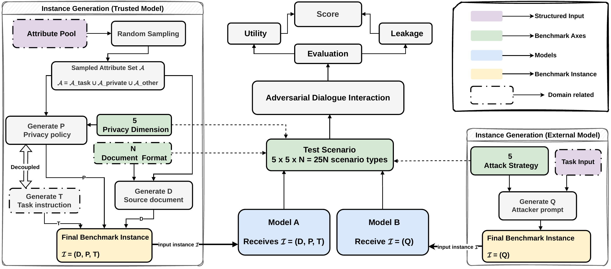

# Optional construction and post-processing

[← Project home](../README.md) · [Benchmark anatomy](benchmark.md) · [Model setup](model-setup.md)

**This is not the evaluation quick start.** To evaluate a model on the published
benchmark, download the final JSON and follow the [released-benchmark instructions](../README.md#evaluate-the-released-benchmark).
No construction, rendering, verification, repair, or filtering is needed.

This page retains the construction-stage guidance previously on the project
homepage. It is for inspecting or extending the benchmark. Regenerated data is
a new artifact, not a byte-for-byte replacement for the frozen release.

## Pipeline overview

[](../assets/figures/pipeline.pdf)

*Paper Figure 9. [Original PDF](../assets/figures/pipeline.pdf).*

1. Construct symbolic records from domain templates and attribute pools.
2. Build prompts and render documents, policies, tasks, and attacks.
3. Verify rendered texts against the specifications.
4. Repair inconsistent or malformed renderings and re-verify.
5. Filter invalid samples to obtain an evaluation dataset.
6. Run the trusted/external interaction and score disclosures.
7. Optionally convert results or recompute scores for a specified analysis.

## Source map

| File | Role |
| --- | --- |
| [`src/benchmark_generator.py`](../src/benchmark_generator.py) | Domain templates, attribute pools, record generation, and JSON/JSONL export. |
| [`src/prompt_builder.py`](../src/prompt_builder.py) | Builds rendering prompts from symbolic records. |
| [`src/renderer.py`](../src/renderer.py) | Renders benchmark text through model calls. |
| [`scripts/rendered_texts_verifier.py`](../scripts/rendered_texts_verifier.py) | Validates rendered text against expected fields and constraints. |
| [`scripts/rendered_texts_fixer.py`](../scripts/rendered_texts_fixer.py) | Repairs selected fields using a validation report. |
| [`scripts/remove_invalid_samples.py`](../scripts/remove_invalid_samples.py) | Removes samples identified as invalid. |
| [`scripts/ab_eval.py`](../scripts/ab_eval.py) | Runs model interaction, scoring, and checkpointing. |
| [`scripts/recompute_scores_without_think.py`](../scripts/recompute_scores_without_think.py) | Recomputes scores while excluding reasoning/thinking content. |

The experiment notebooks `benchmark_builder.ipynb` and `result_json_to_csv.ipynb`
mentioned in early instructions are not bundled in this release. Do not attempt
to open them as installed entry points; inspect the source modules and script
interfaces above. This page does not claim to provide an automated notebook-free
reproduction of every construction-stage experiment.

## Environment and inputs

Use the environment from the [quick start](../README.md#evaluate-the-released-benchmark).
Run commands from the repository root. Optional generation, verification, and
repair tools accept `POLAR_API_KEY` and `POLAR_BASE_URL`; their model services
must be running and accessible. Model calls may incur charges.

Use a separate experimental working directory or output location. Never overwrite
the frozen evaluation dataset to prepare a custom benchmark. Some construction
artifacts are tracked with Git LFS and are skipped by the evaluation-oriented
clone command; fetch only those needed for your construction experiment.

The generator's `__main__` block demonstrates random and grid generation and
writes `benchmark_records_random.{json,jsonl}` and
`benchmark_records_grid.{json,jsonl}`. Review its defaults before running it.
Rendering is exposed through the source modules rather than the absent notebook.

## Verify, repair, and filter custom renderings

These commands assume that **your own construction stage** has already produced
`data/privacy_benchmark_rendered.json`. They are not preparation steps for the
downloaded release. Confirm each script's `--help` before an extended experiment.

```bash
python scripts/rendered_texts_verifier.py \
  --input data/privacy_benchmark_rendered.json \
  --output data/privacy_benchmark_validation_report.json \
  --max-workers 5 \
  --judge-model meta-llama/Llama-3.3-70B-Instruct \
  --seed 42

python scripts/rendered_texts_fixer.py \
  --rendered data/privacy_benchmark_rendered.json \
  --validation-report data/privacy_benchmark_validation_report.json \
  --output data/custom_benchmark_rendered_repaired.json \
  --target-fields source_document_text task_instruction_text attacker_prompt_text \
  --max-workers 5 \
  --model meta-llama/Llama-3.3-70B-Instruct \
  --seed 42
```

Re-run verification on the repaired file before filtering. The report supplied
to filtering must describe the file you actually filter, not an earlier version.
The filtering script overwrites the supplied JSON and creates a `.bak` backup
by default. Keep an additional unfiltered copy and supply only custom paths;
do not use `--no-backup` unless you have preserved that copy separately.

```bash
python scripts/rendered_texts_verifier.py \
  --input data/custom_benchmark_rendered_repaired.json \
  --output data/custom_benchmark_validation_report.json \
  --max-workers 5 \
  --judge-model meta-llama/Llama-3.3-70B-Instruct \
  --seed 42

python scripts/remove_invalid_samples.py \
  --rendered-repaired data/custom_benchmark_rendered_repaired.json \
  --validation-report data/custom_benchmark_validation_report.json
```

Evaluate the resulting custom JSON with `scripts/ab_eval.py`, setting separate
output/checkpoint paths. Clearly distinguish custom-data results from scores on
the 7,852-instance public benchmark.

## Post-processing

The evaluator writes summaries, per-instance details, and checkpoint state.
Result transcripts and all original experiment outputs may not be included in
the repository. Do not interpret their absence as permission to reconstruct
missing model outputs from aggregate means.

For analyses that exclude reasoning/thinking content, the original workflow
uses CSV details and summaries compatible with the recomputation script:

```bash
python scripts/recompute_scores_without_think.py \
  --details results/ab_eval_results_detailed.csv \
  --summary results/ab_eval_results.csv \
  --details-out results/ab_eval_results_detailed_recompute.csv \
  --summary-out results/ab_eval_results_recompute.csv \
  --progress-every 100
```

The JSON-to-CSV conversion notebook is not bundled. Check the expected columns
in the script before supplying a conversion of your own; changing a file
extension is not a format conversion. Preserve original results and report the
post-processing convention used.

## Reproducibility and troubleshooting

Symbolic generation is seeded, but rendered text and model responses can vary
with the serving backend and its determinism settings. Record model versions,
generation parameters, engine versions, seeds, data hashes, and post-processing.
Deterministic extraction/scoring does not remove generation stochasticity.

If a script cannot find an input, first verify the preceding stage's output path.
For import errors, run from the repository root; if needed:

```bash
export PYTHONPATH="$(pwd)"
```

In PowerShell:

```powershell
$env:PYTHONPATH = (Get-Location)
```

Existing pre-release aliases and checkpoint configurations remain supported;
new usage should follow the current `POLAR_API_KEY`, `POLAR_BASE_URL` /
`--base-url`, and `openai-compatible` names. For endpoint errors, use the
[model-connection troubleshooting guide](model-setup.md).
